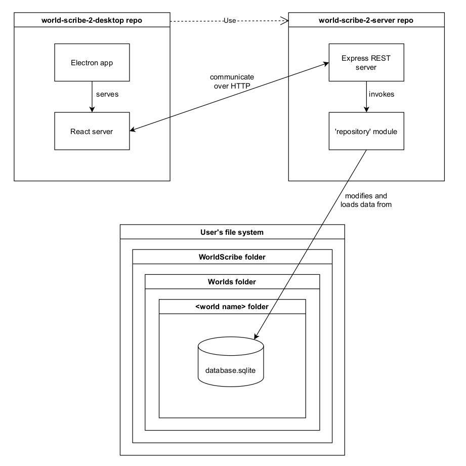

# Developer Guide

## Architecture of World Scribe 2

The app's infrastructure is split up into 2 repos:

- This repo, which handles a React server and serving up its UI content through an Electron desktop interface
- The [world-scribe-2-server](https://github.com/averi-studios/world-scribe-2-server) repo, which handles an Express server that is responsible for loading and modifying persistent user data (e.g. World data)

This repo loads the server repo as a dependency. They communicate with each other over HTTP calls.

Below, you can find a high-level diagram illustrating the full architecture.

## Running the App Locally

### Pre-Requisites

- All operating systems:

  - Node.js 14.14.0

    - We recommend installing it through [nvm](https://github.com/nvm-sh/nvm) (for Windows, use [nvm-windows](https://github.com/coreybutler/nvm-windows) instead). nvm will allow you to easily switch between Node versions.

- Windows:

  - [windows-build-tools](https://www.npmjs.com/package/windows-build-tools)

- Mac & Linux:

  - Python 2.7

### Instructions

1. Open the root directory of this project in your command line tool
2. Run `npm install` -- note that this may take several minutes, as some dependencies will need to be built natively for your operating system
3. Run `npm start`

This will start the React server at http://localhost:49001 and continuously poll that address until it is finished setting up (you will likely see many “Error: connect ECONNREFUSED 127.0.0.1:49001” messages in your command line tool while this is happening).

Once the React server is ready, the backend server will start up at http://localhost:49000, and then the desktop app itself will automatically open in a new window.

## Linking to a Local Server Copy

If you’re working on this repo and the [world-scribe-2-server repo](https://github.com/averi-studios/world-scribe-2-server) simultaneously, you’ll probably want to link the two so that they can be tested together.

To do that, you can use the `npm link` command. Here are the full steps:

1. In your command line tool, navigate to the root directory of the world-scribe-2-server repo
2. Run `npm link`
3. Navigate to the root directory of this repo (world-scribe-2-desktop)
4. Run `npm link world-scribe-2-server`

Now, any changes in your local world-scribe-2-server copy will be picked up by the desktop app.

To unlink your local server copy and go back to using the remote copy installed via npm install, run this inside of world-scribe-2-desktop’s root directory: `npm unlink --no-save world-scribe-2-server`

## Building Installers

We use [electron-builder](https://www.electron.build/) to generate executable installers for Windows, Mac, and Linux.

To build an installer **for your current operating system**, run: `npm run build`

If your machine is a Mac, you can build for Windows and Linux as well. (Windows and Linux machines can only target their own operating systems, unfortunately.) Here are the commands for building for specific platforms:

- npm run build-windows
- npm run build-mac
- npm run build-linux