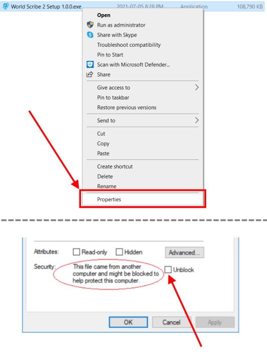

# Installing the App

## Instructions

1. Go to the [Releases](https://github.com/averi-studios/world-scribe-2-desktop/releases) page

2. Click on the title of the newest release. For example: "Version 1.0.0".
3. Follow the remaining instructions depending on your operating system:
   1. **Windows**
      1. Download the **.exe** file
      2. In File Explorer, double-click on the .exe file to start the installation wizard
      3. Follow all installation steps
      4. If a pop-up appears asking to grant the app network access, choose to accept
   2. **Mac**
      1. Download the **.dmg** file
      2. In Finder, double-click on the .dmg file
      3. In the pop-up, drag-and-drop the World Scribe icon onto the Applications folder
   3. **Linux**
      1. Download the **.AppImage** file
      2. In a terminal, `cd` to the folder containing the .AppImage file
      3. Grant execute permissions on the .AppImage file by running: `chmod +x <name of .AppImage file>`
      4. Start the app by running: `./<name of .AppImage file>`

## Important note for Windows 10 users

 When you launch the .exe file, you may be blocked by an error message similar to: “Windows Defender SmartScreen prevented an unrecognized app from starting”.

To get around this blockage, please follow these steps:

1. In File Explorer, right-click on the .exe file.
2. Select “Properties”
3. At the bottom of the pop-up, tick the checkbox labelled “Unblock”

Here is a visual guide:

This is necessary because the app is not currently code signed (and code signing a Windows application is moderately expensive).
