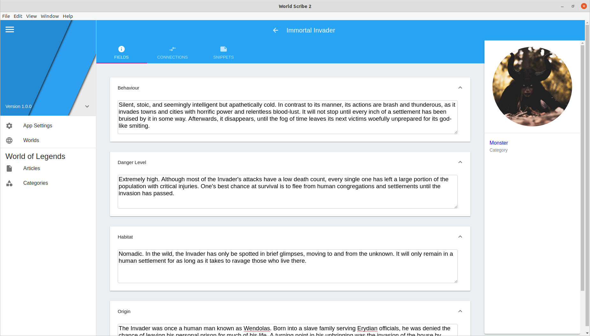
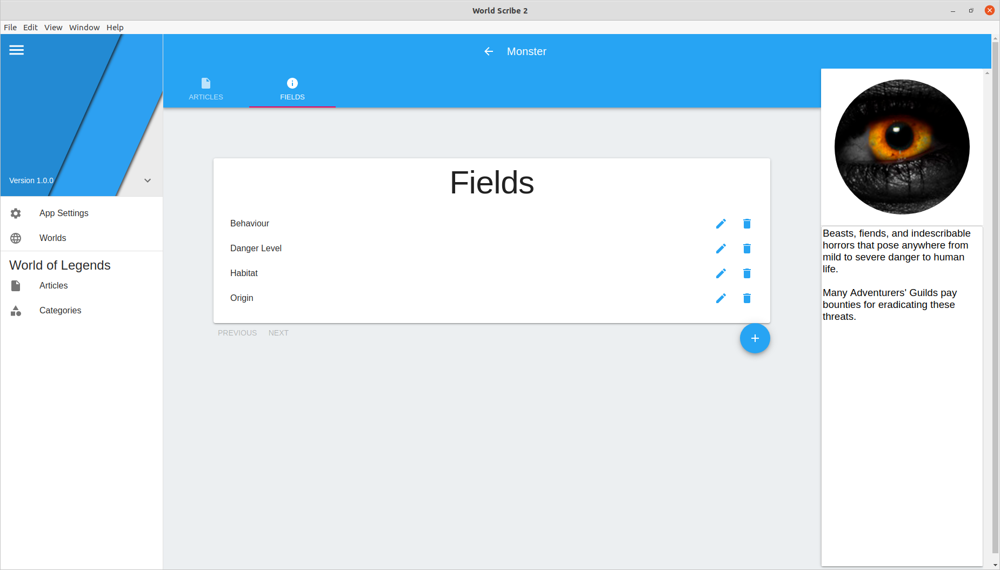
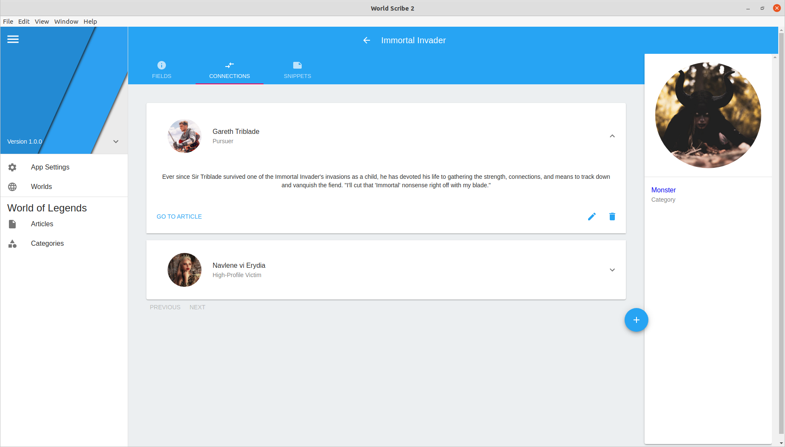
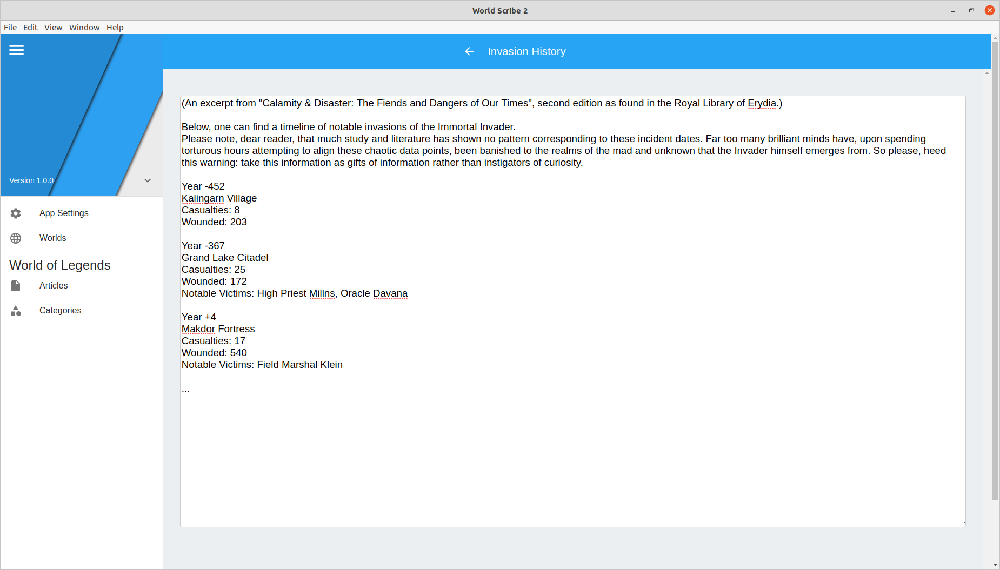

<h1 align="center">World Scribe 2</h1>

<h2 align="center">Build new worlds, one idea at a time.</h2>

<h2 align="center"></h2>

<h3 align="center"><a href="https://github.com/averi-studios/world-scribe-2-desktop/blob/master/docs/installation.md"><b>> Install Now! Available on desktop Windows, Mac, and Linux <</b></a></h3>

### Features

Create an **Article** for each singular entity within the realm of your creation. Articles are the building block of a world and act as an extensive encyclopedia page detailing everything you can think of about a person, place, monster, or what-have-you!

***

Organize your Articles into **Categories**. Articles in a Category all share the same set of information **Fields**. You can create more Categories and edit the Fields they possess at any time.

***

Map out relationships between your Articles using **Connections**. In a Connection between two Articles, you can describe each Article's role in relaton to each other, as well as include a long-form description describing the nature and history of the relationship.

***

Need to add unique information to an Article that doesn't fit into any of its Fields? **Snippets** have you covered! Use them to write long-form text pertaining to an Article, like a speech, a diary page, a song — the possibilities are endless!

***

### For Developers

World Scribe 2 is an open-source project licensed under the GPLv3.

To contribute, please [check out the source code repository](https://github.com/averi-studios/world-scribe-2-desktop).

***

### [Frequently Asked Questions (importing from Android, etc.)](https://github.com/averi-studios/world-scribe-2-desktop/blob/master/faq.md)

***

### [Privacy Policy](https://github.com/averi-studios/world-scribe-2-desktop/blob/master/terms.md)
